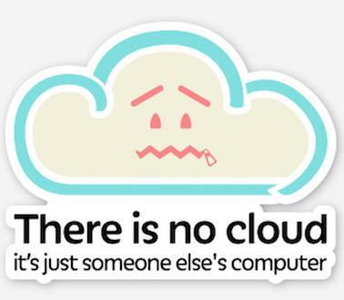

# Introduction to Cloud Computing

In this lesson you'll learn how to connect and use a linux server.
Most bioinformaticians worldwide connect daily to cloud computing services to perform their analyses.

There are several reasons for this.
Firstly biology - like most other areas of science - is dealing with a deluge of data due to the rapid advancement of data collection methods.
It is now common that data collected for an experiment doesn't fit on a researcher's laptop and that the resources needed for running an analysis far exceed a desktop computer's computing power.

Secondly the vast majority of research software are developed and released for linux. Most people run MacOS or Windows on their desktop computers and laptop, which makes the installation of some software difficult or at the very least inconvenient.

## What is the cloud anyway?

The cloud is basically lots of servers (thing big big computers) stacked together in a giant, powerful infrastructure. You can lend part of this infrastructure for your computing needs. While it is not cheap, it is generally scalable and guarantees a stable environment.

In research there are two approaches to lend computing time and power: either (a) you lend computing time and resources from a commercial provider or you obtain access to a research computing infrastructure. Some countries have built national infrastructures where you can apply for computing time for your research projects. Most academic institutions or departments also have their own computing resources.

### Popular cloud/HPC services

* Academic:
    * 🇸🇪 [UPPMAX](http://uppmax.uu.se)
    * 🇺🇸 [Jetstream](https://www.jetstream-cloud.org)

* Commercial:
    * [amazon web services](https://aws.amazon.com)
    * [google cloud](https://cloud.google.com)
    * [microsoft azure](https://azure.microsoft.com)

For this tutorial, we'll use Microsoft azure.
